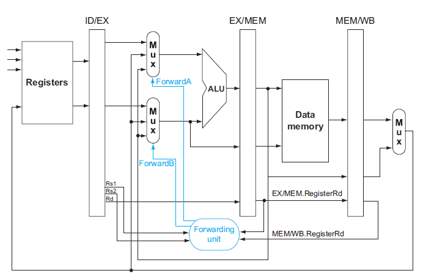

# Homework 2

## Question 1

This exercise is intended to help you understand the cost/complexity/performance trade-offs of forwarding in a pipelined processor. Problems in this exercise refer to pipelined datapaths below. (Some data signals are omitted.)



These problems assume that, of all the instructions executed in a processor, the following fraction of these instructions has a particular type of RAW data dependence.

| EX to 1st only | MEM to 1st only | EX to 2nd only | MEM to 2nd only | EX to 1st and EX to 2nd |
| :-----------------: | :------------------: | :-----------------: | :------------------: | :-------------------------------: |
|         5%          |         20%          |         5%          |         10%          |                10%                |


The type of RAW data dependence is identified by the stage that produces the result (EX or MEM) and the next instruction that consumes the result (1st instruction that follows the one that produces the result, 2nd instruction that follows, or both).

We assume that the register write is done in the first half of the clock cycle and that register reads are done in the second half of the cycle, so “EX to 3rd” and “MEM to 3rd” dependences are not counted because they cannot result in data hazards. We also assume that branches are resolved in the EX stage (as opposed to the ID stage), and that the CPI of the processor is 1 if there are no data hazards.

Assume the following latencies for individual pipeline stages. For the EX stage, latencies are given separately for a processor without forwarding and for a processor with different kinds of forwarding.

1. For each type RAW dependency above, how many nop instructions would need to be inserted to allow your code run correctly on a pipeline with no forwarding or hazard detection?

2. Analyzing each dependency type independently will over-count the number of nop instructions needed to run a program on a pipeline with no forwarding or hazard detection. In the code below, how many nop instructions are over-counted by analyzing dependency type independently?

```
ld  x11, 0(x5)
add x12, x6, x7
add x13, x11, x12
add x28, x29, x30
```

3. Assuming no other hazards, what is the CPI for the program described by the table above when run on a pipeline with no forwarding? What percent of cycles are stalls? (For simplicity, assume that all necessary cases are listed above and can be treated independently.)

4. What is the CPI if we use full forwarding (forward all results that can be forwarded)? What percent of cycles are stalls?

5. Let us assume that we cannot afford to have three-input multiplexors that are needed for full forwarding. We have to decide if it is better to forward only from the EX/MEM pipeline register (next-cycle forwarding) or only from the MEM/WB pipeline register (two-cycle forwarding). What is the CPI for each option?

6. For the given hazard probabilities and pipeline stage latencies, what is the speedup achieved by each type of forwarding (EX/MEM, MEM/WB, for full) as compared to a pipeline that has no forwarding?


## Question 2

Problems in this exercise refer to the following sequence of instructions, and assume that it is executed on a five-stage pipelined datapath (assume double bump):

```
add x15, x12, x11
ld  x13, 4(x15)
ld  x12, 0(x2)
or  x13, x15, x13
sd  x13, 0(x15)
```

1. If there is no forwarding or hazard detection, insert nop instructions to ensure correct execution.

2. If the processor has forwarding, but we forgot to implement the hazard detection unit(here means we have implemented forwarding path and condition detection, but no stall strategy), what happens when the original code executes?

3. If there is forwarding, how many cycles does the code cost?


## Question 3

The importance of having a good branch predictor depends on how often conditional branches are executed. Together with branch predictor accuracy, this will determine how much time is spent stalling due to mispredicted branches. In this exercise, assume that the breakdown of dynamic instructions into various instruction categories is as follows (here jump instructions are omitted):

| R-type | branch |  ld  |  sd  |
| :----: | :----: | :--: | :--: |
|  45%   |  25%   | 25%  |  5%  |

Also, assume the following branch predictor accuracies:

| Always-Taken | Always-Not-Taken | 2-Bit |
| :----------: | :--------------: | :---: |
|     45%      |       55%        |  85%  |

1. Stall cycles due to mispredicted branches increase the CPI.
What is the extra CPI due to mispredicted branches with the Always-Taken predictor?
Assume that branch outcomes are determined in the ID stage and applied in the EX
stage that there are no data hazards, and that no delay slots are used.

2. Repeat question3.1 for the “Always-Not-Taken” predictor.

3. Repeat question3.1 for the “2-Bit” predictor.

4. With the 2-Bit predictor, what speedup would be achieved if we could convert half of the branch instructions to an ALU instruction? Assume that correctly and incorrectly predicted instructions have the same chance of being replaced.

5. With the 2-bit predictor, what speedup would be achieved if we could convert half of the branch instructions in a way that replaced each branch instruction with two ALU instructions? Assume that correctly and incorrectly predicted instructions have the same chance of being replaced.

6. Some branch instructions are much more predictable than others. If we know that 80% of all executed branch instructions are easy-to-predict loop-back branches that are always predicted correctly, what is the accuracy of the 2-Bit predictor on the remaining 20% of the branch instructions?

## Double Bump

Here I want to talk about "double bump". It means that we can write the result to register when clock's negative edge is coming. By doing this, writing back is done in the first half of the clock cycle like description in Question 1 : **we assume that the register write is done in the first half of the clock cycle and that register reads are done in the second half of the cycle, so “EX to 3rd” and “MEM to 3rd” dependences are not counted because they cannot result in data hazards.**

It works because register writing costs not much time. The register's signal will turn to the new data in a short time. In our experiment, you can also use this strategy to avoid these two types of data hazards.