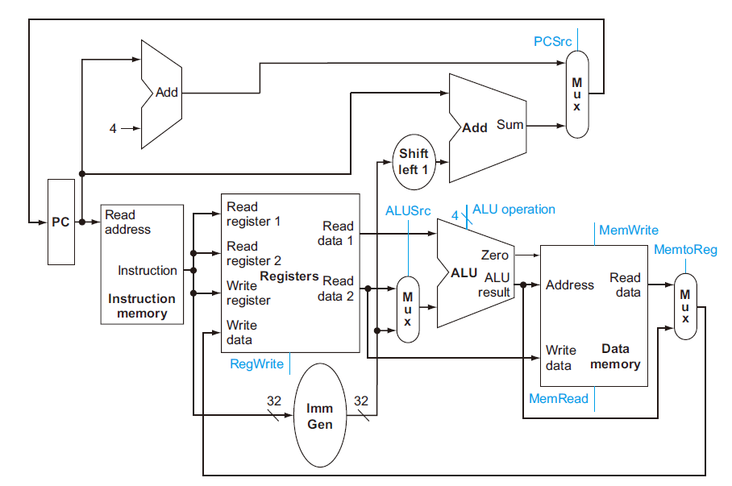

# 实验0 - CPU初步设计与程序执行过程

## 1. 实验目的

-   回顾单周期CPU数据通路与控制器设计过程

-   回顾程序执行过程

-   为之后搭建流水线CPU打下基础

## 2. 实验环境

-   **HDL**：Verilog、SystemVerilog

-   **IDE**：Vivado

-   **开发板**：NEXYS A7

## 3. 实验原理

### 3.1 概述

单周期CPU主要特征是在一个周期内完成一条指令，也就意味着其CPI(cycle per instruction)是1。考虑到不同的指令都需要在一个周期内完成，因而单周期CPU时钟频率是以执行最慢的那条指令作为基准，这也是单周期CPU最大的缺陷之一。

我们可以把单周期CPU分成数据通路和控制单元两个模块，本次实验将回顾这两个模块的设计与结合过程。

### 3.2 程序执行流程阶段

为了之后能和流水线CPU进行衔接，我们把单周期CPU数据通路划分成5个阶段（stage):

1.  instruction fetch (IF)

2.  instruction decode (ID)

3.  execution (EX)

4.  memory access (MEM)

5.  register write back (WB)

### 3.3 数据通路图

  

具体的设计要点参见计算机系统Ⅰ实验10的实验指导书。

### 3.4 控制单元

控制单元，也称译码器，它的作用是解码指令，发出信号，告诉Datapath应该执行什么操作。其设计过程主要包括对指令格式的解析，与相应控制信号的设计。[表1](#Table-1)和[表2](#Table-2)列出了参考的控制单元信号设计，大家也可以自行设计控制信号。

| **信号线** | **含义** | **1'b0** | **1'b1** |
| :---------: | :------------------: | :---------------: | :----------------: |
| reg\_write  | 写寄存器            | 不写回           | 写回            |
| alu\_src\_b | ALU B口的数据来源    | 数据来自立即数imm | 数据来自Reg\[rs2\] |
| mem\_write  | data memory读写    | 读data memory    | 写data memory |
| branch      | 是否为branch指令    | 不是             | 是             |
| b\_type     | branch指令的具体类型 | bne             | beq           |

表1：1位信号线的含义

| **信号线** | **含义** | **2'b00** | **2'b01** | **2'b10** | **2'b11** |
| :----------: | :---------------------: | :------------------: | :----------: | :---------: | :---------: |
| pc\_src      | pc的数据来源           | pc+4，branch跳转地址 | jalr跳转地址 | jal跳转地址 | 闲置        |
| mem\_to\_reg | 写回Registers的数据来源 | alu                | imm        | pc+4       | data memory |

表2：2位信号线的含义

### 3.5 实现指令

实现的指令分为整数运算指令、跳转指令、访存指令三类，分别包含ADDI、SLTI、ANDI、ORI、LUI、ADD、SLT、AND、OR、SLL、JAL、BEQ、BNE、LW、SW。各指令详细格式与功能定义见计算机系统I实验10实验指导书。

## 4. 实验要求

-   复现32位单周期CPU数据通路设计，实现 [**3.5**](#Chapter-3.5)中列出的指令

-   通过仿真测试和上板验收
    
-   完成实验报告：

    -   阐述自己设计的CPU能够实现的指令，及其运行过程和功能描述

    -   描述设计的数据通路，包括设计的主要模块部件，部件间连接通路

    -   描述设计的控制器，包括数据通路中主要部件所需的控制信号，指令与控制信号间的译码过程
