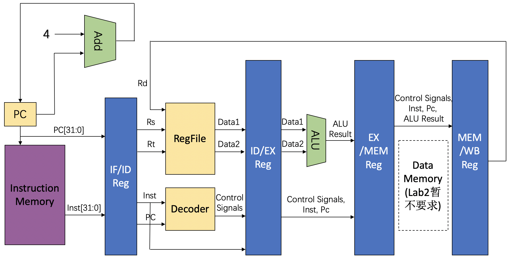

# 实验1-1: 流水加法机

## 1. 实验目的

- 理解流水线的基本概念与思想
- 基于在单周期CPU中已经实现的模块，实现5级流水线框架
- 理解流水线设计在提高CPU的吞吐率，提升整体性能上的作用与优越性

## 2. 实验环境

- **HDL**：Verilog
- **IDE**：Vivado
- **开发板**：Nexys A7
- 提供测试程序和测试框架

## 3. 实验原理

### 3.1 流水线与单周期CPU设计对比

关于流水线的基本设计思想已经在计算机体系结构课程的理论部分中提及，这里不再赘述。但实际落实到电路设计，与此前计算机组成中设计的单周期CPU相比还是有很多不同之处。

在同一时刻下，流水线的五个流水级运行的指令实际各不相同。因此，我们一般将一条指令所需的控制信号一起存在流水段间寄存器中，随指令其他信息一起顺着流水线传递，这里的段间寄存器是指：IF/ID寄存器、ID/EX寄存器、EX/MEM寄存器、MEM/WB寄存器这四个用于流水段间传递指令信息的寄存器组。例如add指令，在ID阶段对指令解码，得到所使用的寄存器rd, rs, rt需要等待到WB阶段写回，就需要由段间寄存器存储rd, rs, rt的值，一级一级地传递到WB阶段。

原则上每一拍过后，流水线都会向前流动一段。第x拍IF段内取出指令，第x+1拍该指令流入ID段进行译码，例如译码得到的是lw指令，那么第x+2拍流入EX段内指令lw完成地址计算，第x+3拍lw流入MEM段完成访存的读取，第x+4拍流入WB阶段将访存中的值写回寄存器。一般而言段内任务需要当拍完成，因为在下一拍时，段内的信号就会变为下一条流入指令需要的信号，在使用段间寄存器以外的寄存器时，务必要注意可能产生的时序问题。

其他关于单周期、流水线CPU的特点对比如表1所示，请在认真理解三者的区别之后再进行实验。

|            |  Single-cycle  |    Pipeline    |
| :--------: | :------------: | :------------: |
|  模块复用   |    结构冲突     |    结构冲突    |
| 街段寄存器  |       无       |       有       |
|   状态机   |       无       |       无       |
|  时钟频率   |  取决于最长指令  | 取决于最长阶段 |
|    CPI    |       1        |  1（极限值）   |

表1：2种 CPU 设计对比

### 3.2 流水级划分

流水级划分的一般经验准则：

1.  **按功能划分**。不同的功能最好属于不同的流水级，因为一般情况下，单个流水级功能越少，组合逻辑越简单，延迟越低，时钟频率越高。

2.  **按时间划分**。在有些组件中（例如译码器），可能会出现较长连续的组合电路；它们往往会成为系统性能的瓶颈，但拆分组合电路、在中间插入阶段寄存器，并不会对电路的功能造成影响。由于流水线时钟频率取决于最长阶段，一般情况下，阶段越平均，CPU的整体利用率越高，性能越高。

3.  **按空间划分**。空间上远离的组件应该尽可能属于不同的流水级，使用寄存器隔断往返的长距离通信带来的时间开销。在FPGA板上，由于各类硬件资源已经固定而无法任意挪动，按空间划分显得更为重要。

根据经验准则，我们可以构造最基础的5段流水线设计（取指、译码、执行、访存、写回），在此基础上，我们可以根据实际布线中观察到的时间开销有针对性地进行优化。

## 4. 实验步骤与要求

### 4.1 实验要求

在本次实验中，仅要求实现 addi 和nop指令，能正常运行给出的测试程序，仿真结果正确。本实验提供参考设计图（控制信号及其他必要的模块接口需自己设计添加，该设计图仅起提示模块逻辑关联的作用），见图1。鼓励自主设计CPU结构，但请给出如此设计的理由。

本次实验的主要目的在于建立起大家对于流水线的概念，后期将在此基础上对CPU的功能进行扩展，有余力的同学可提前完成**ALU和译码器**功能的扩展（参考RV32I指令集）。

为便于后续实验当中对结构的修改，请尽可能对各功能模块做好封装，并设计好合适的接口（包括调试接口），但是请不要封装流水级（例如Module IF, ID, EX），因为在后续优化中可能会经历流水级的拆分和重组。

{.center}

图1：流水线 CPU 设计简图

**请注意**，我们会保证本次实验的测试程序不存在加法指令的数据竞争，同学们无需考虑竞争相关的设计问题。

本次实验的测试文件位于[gitee](https://gitee.com/zjusec/sys2lab-21fall/tree/master/src/lab1-1)。

### 4.2 实验步骤

1.  使用开发工具建立工程，推荐在 Vivado 2019.2 以上版本完成。
2.  根据参考设计图或自己设计的设计图搭建完整的流水线加法机,继续使用 Nexys7 对应的外设进行实验，实现lab1的流水加法机替换lab0中的CPU模块。请注意Memory**必须使用Vivado提供的Block RAM IP核**完成，以免LUT资源不够支持CPU设计。
3.  在本实验中不要求对数据通路进行专门的封装，推荐直接将Control Unit (Decoder) 视为译码模块放在 ID 段中。
4.  进行仿真测试，以检验 CPU 基本功能。
5.  调整时钟频率，确保时钟周期长度不小于最长流水段的信号延迟。
6.  进行上板测试，以检验 CPU 设计规范，上板测试调试工具相关内容请参考lab0。

## 5. 思考题

1. 对于 part1 (2-14行)，请计算你的 CPU 的 CPI，再用 lab0 的单周期 CPU 运行 part1，对比二者的 CPI。
2. 对于 part2 (24-39行)，请计算你的 CPU 的 CPI（假设 nop 不计入指令条数），再用 lab0 的单周期 CPU 运行 part2，对比二者的 CPI。试解释为何需要添加 nop 指令（提示：如果不添加，会导致什么问题？）。
