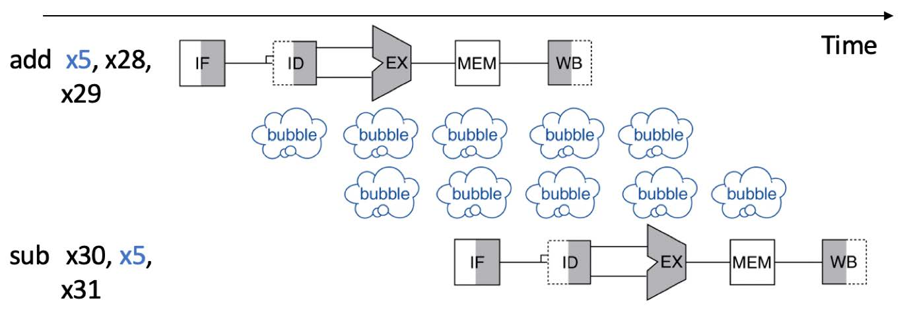

# 实验2-1: 暂停与冒险

## 1. 实验目的

- 完善流水线的基本功能，实现流水线暂停机制

- 深入理解流水线冒险，掌握利用stall 处理流水线冒险，保证流水功能正确性的基本技术

- 尝试思考改进的方案

## 2. 实验环境

- **HDL**：Verilog
- **IDE**：Vivado
- **开发板**：Nexys A7

## 3. 实验原理

### 3.1 stall 介绍

在流水线的运行过程中，同一时刻内不同流水段运行的指令各不相同，如果说指令之间不存在关联性和依赖性，那么即使是像我们在 lab1-2 中设计的简单流水线也可以保证高效、持续地运行。但这种情况总是理想的，在实际的运行过程中，指令间的关联性和依赖性往往无法避免，下图给出的便是一组数据冲突的案例。

在上一次实验中，我们的测试用例经过设计，在相关联的指令间插入 nop 指令，在分支跳转语句后插入额外的 nop 指令，避免了竞争冒险问题。在实际的系统中，这相当于将流水线暂停的工作交给编译器去处理，但这一方面会加重编译器的负担，另一方面也不利于处理器的后续优化。

本次实验需要在处理器中实现 stall 机制，当流水线检测到数据冲突或者控制跳转指令后通过 stall 机制处理，保证执行结果的正确性。

### 3.2 stall 实现分析

以数据冲突为例进行分析，常见的数据相关有 WAW, WAR, RAW ，由于我们的指令都是顺序执行的，这里只考虑 RAW 一种情况即可。当指令流入 ID 阶段时，我们对指令进行译码，根据译码的结果读取对应寄存器的值，此时如果发现待读取的寄存器发生了 RAW 冲突，就要触发 stall 机制进行处理。

我们不妨假设 ID 段要读取的寄存器设与 EX 段将要写入的寄存器发生了冲突。（与 MEM, WB 段冲突的情况请同学们自行考虑）那么从逻辑上我们的 stall 机制应当使得 ID 段的指令被锁住， 直到寄存器的值可以被正确读取前都不应当向后流入 EX 段，否则读取的寄存器值错误，会影响指令执行的正确性。例如相邻的两条指令为 addi x1, x0, 1; add x2, x1, x0 第二条指令执行时 x1 寄存器的值应该为1，而在流水线中上一条指令还并没有执行完，如果不添加 stall 机制，读取到的值为第一条指令尚未执行时 x1 寄存器的值。

也就是说接下来的一个周期，该指令仍然锁住在 ID 阶段，直到与之冲突的 EX 阶段指令流入到 WB 段完成写回，使得该指令可以读取到正确的寄存器的值时，该指令才可以流入到 EX 段。那么我们以 ID 阶段来看，向前看 IF, ID 两阶段都应当锁住当前的指令和状态，等待若干周期后继续执行，向后看 EX, MEM, WB 阶段应当继续执行段内的指令，正常的让指令流入下一阶。

再考虑分支跳转指令的情况，当执行到分支跳转指令时，由于可能发生跳转，在 pc 置位前已经流入 IF 段的指令可能并不是我们将要执行的指令， stall 机制需要考虑流水线内指令的锁存和刷新两方面的问题，对于分支跳转指令，根据同学们实现的流水线不同，也需要 stall 不同的周期数。

## 4. 实验要求和步骤

### 4.1 实验要求

在 lab1-2 的基础上加入 stall 机制。

### 4.2 实验步骤

1. 在 lab1-2 的基础上实现 stall 机制。

2. 进行仿真测试，以检验 CPU 基本功能。

3. 进行上板测试，以检验 CPU 设计规范。

## 5. 思考题

1. 请你对数据冲突情况进行分析归纳，试着将他们分类列出。

2. 如果 EX, MEM, WB 段中不止一个段的写寄存器与 ID 段的读寄存器发生了冲突，该如何处理？