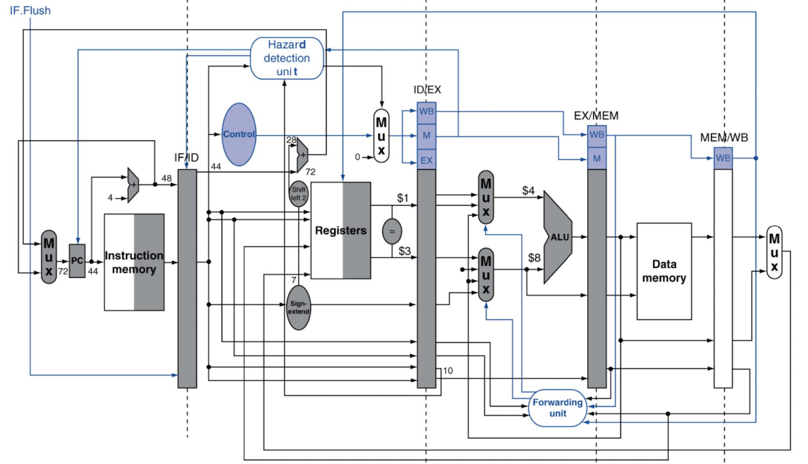

# 实验2-2: 旁路优化 Forwarding

## 1. 实验目的

- 完善流水线的基本功能，实现 Forwarding 机制

- 尝试思考改进的方案

## 2. 实验环境

- **HDL**：Verilog
- **IDE**：Vivado
- **开发板**：Nexys A7

## 3. 实验原理

### 3.1 forwarding 介绍

在流水线的运行过程中，数据冲突是拖累流水线效率的一个重要的因素。在顺序单发射处理器中，数据冒险只需要考虑RAW一种情况，本质上就是由读写同一个寄存器所导致的，所以数据冒险本身的检测只需对流水线中相应流水段中指令的寄存器编号进行比较，即可对数据冒险的发生进行判断。

实现 Forwarding 的基本功能需要在流水线的基础上添加冲突检测逻辑和相应的数据通路，这样就能够在WB阶段之前，将最新的寄存器的数据回传给后续的指令，减少 stall 的周期数。

## 4. 实验要求和步骤

### 4.1 实验要求

在 lab2-1 的基础上加入 Forwarding 机制。

### 4.2 实验步骤

1. 在 lab2-1 的基础上实现 Forwarding 机制。

2. 进行仿真测试，以检验 CPU 基本功能。

3. 进行上板测试，以检验 CPU 设计规范。

## 5. 思考题

1. 在引入 Forwarding 机制后，是否意味着 stall 机制就不再需要了？为什么？

2. 你认为 Forwarding 机制在实际的电路设计中是否存在一定的弊端？如果存在，请给出你的理由。